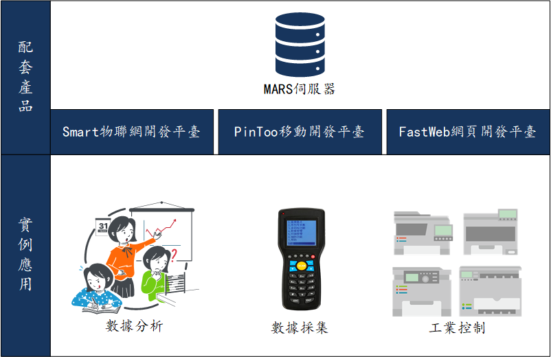
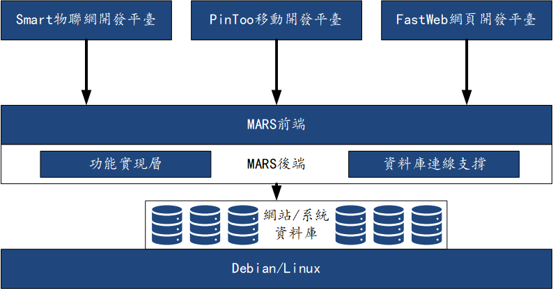
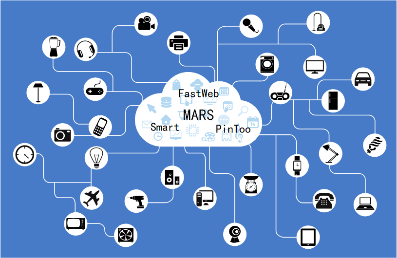

# MARS
MARS是執行在Linux下的商業軟體應用伺服器，包括資料庫存取、檔案傳輸、輕度Web服務，支援多種資料庫的連線(MSSQL、MySQL、PostgreSQL等)，執行簡單高效，能適應各種複雜場景下的執行。

> **加入 Facebook 社團**
>
> [https://www.facebook.com/groups/isoface/](https://www.facebook.com/groups/isoface/)
> 
> **點讚追蹤 Facebook 粉絲專頁**
> 
> [https://www.facebook.com/AIOT.ERP](https://www.facebook.com/AIOT.ERP)

## MARS 特色

MARS執行在Linux下，可實現更多的服務個性化場景，降低圖形界面對操作系統的影響，極大提升系統執行的穩定性。

1. 與Linux整合，實現更低成本、更快速、更穩定的服務。
2. 支援多帳套、多資料庫的連線方式。
3. 數據傳輸採用加密傳輸、即時壓縮，使用高效數據連線池，提高併發迴應速度，安全有保障。
4. 支援自動重連機制，使用者端和伺服器之間，服務端和資料庫之間都支援這種重連機制。
5. 支援多表事務更新、多表聯集查詢更新，保證數據的一致性。
6. 支援直接存取各類相容的管理系統資料庫，輕鬆地與現有的網站、管理系統進行整合。

## MARS通訊架構

MARS與TARS同源，是愛招飛自主研發的控制平臺，通過此平臺可實現集中控制，資源共享，協調互動，智慧控制的功能。擴充套件原有的管理系統的功能，實現更便捷的資料庫連線與讀取效能。

## MARS的運用

MARS是執行在Linux下的物聯網整合雲端平臺，為企業與工業應用提供如下的強大功能：

1.  支援不同型別的資料庫儲存
    
    MARS具備不同型別資料庫的對接能力，可實現支援庫一鍵安裝，快速實現資料庫的連線。

2.  強大的數據分析能力與企業管理整合
    
    MARS支援對生產數據與企業經營數據的整合與統計分析，根據歷史數據的分析推測，建立目前狀態以及未來趨勢的評估分析。

3.  作為網站與管理系統的擴充套件元件，擴充套件使用範圍
    
    部分開源的網站框架與管理系統擴充套件功能複雜，如修改原始碼則會導致系統不易維護與更新。使用MARS可間接讀取網站的數據資訊，通過愛招飛產品的客戶端來處理數據，實現部分開源網站框架與管理系統難以實現的功能。

4.  支援高效便捷的工業開發應用Smart
    
    以迅速溝通合作的理念、進行工業應用的開發和部署，支援多種開發語言與開發框架，提供包括身份管理、許可權管理、裝置後勤數據管理…等，在內的豐富微服務模組，將複雜的工業應用拆解成細微的功能模組，通過整合標準化的微服務、微分析和微應用的方式實現快速的工業應用開發。同時並提供高彈性、擴充套件性、高可靠性、容器化的程式執行環境。對於常見的應用環境，提供視覺化開發工具(Smart)，支援工業運營人員構建自訂的監控和分析應用。

5.  支援移動開發應用PinToo
    
    使用簡潔，直覺，強大的前端框架(PinToo)，與MARS系統整合，讓管理系統的運用更快速、簡單。TARS與PinToo整合的目地就是讓企業以更高的開發效率；滿足企業對於移動應用的需求。

6.  支援網頁開發平臺FastWeb
    
    作為網頁端的開發平臺，FastWeb可以與MARS整合，實現更豐富更快速的執行體驗，滿足企業對於快速開發的需求。

* **MARS 產品介紹**：https://isoface.net/isoface/production/tool/mars
* **MARS 幫助手冊**：https://isoface.net/isoface/doc/mars/main/